## Intro

Roka provides nodes Scene Graph Analysis.  Contains nodes that will take a set of segmentation masks and boxes and generates a scenegraph. The Scenegraph can be used for downstream tasks
 * Editing models (e.g Flux Klein, Qwen Image Edit) 
 * Debugging prompt comprehension 
 * Support Ideogram V4 prompting 

The nodes including SAM3-powered text segmentation, scene-graph extraction, and text post-processing helpers for prompt or metadata pipelines.

## Examples

The table below shows Ideogram V4 JSON-prompt renders produced from Roka scene-graph composition outputs. Rows that were replaced by the erroneous image safety-filter placeholder are intentionally omitted.

| Source | Composition style | Ideogram V4 render | Render + overlay |
|---|---|---|---|
| Cave skylight | simple | 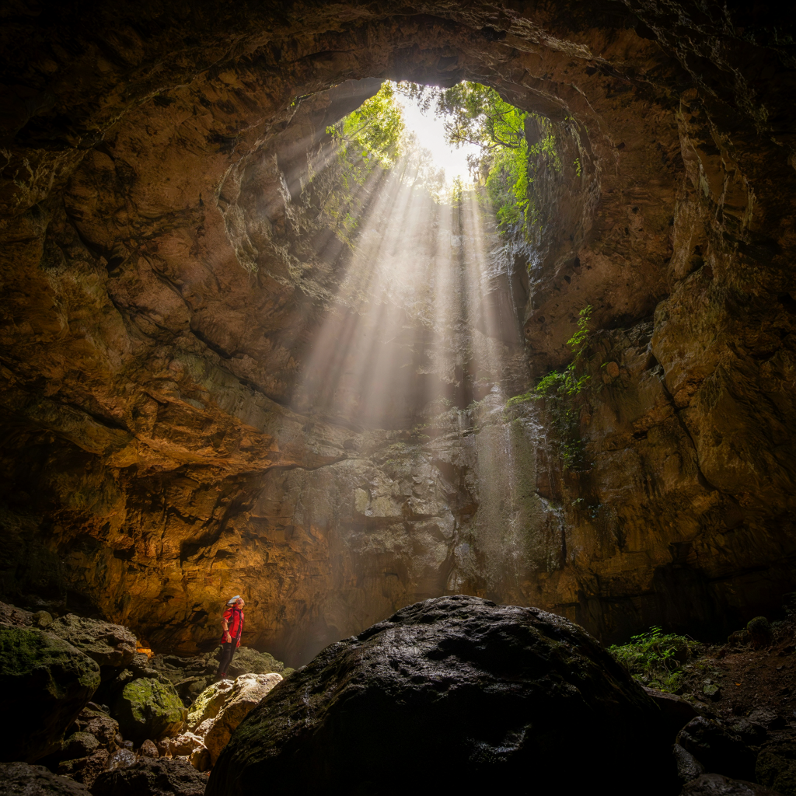 | 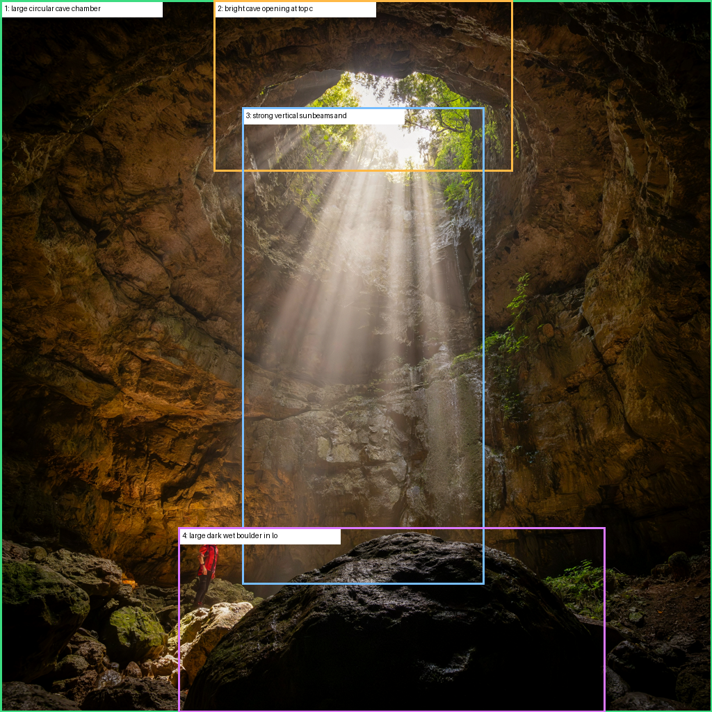 |
| Cave skylight | horizontal | 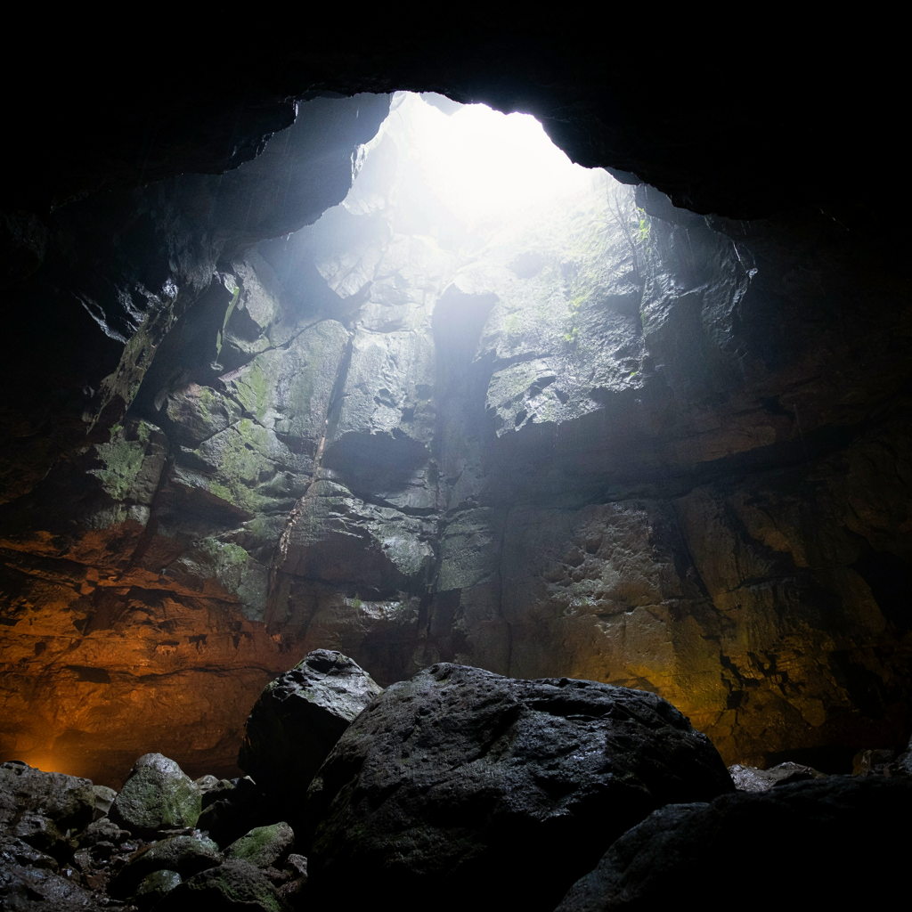 | 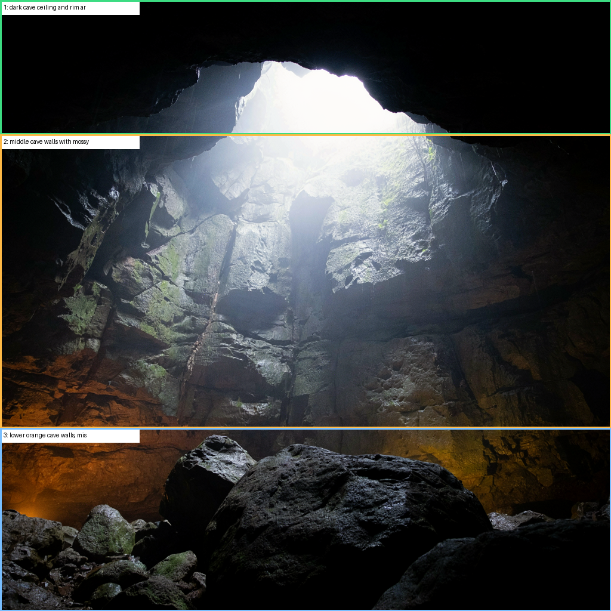 |
| Harbor panorama | simple | 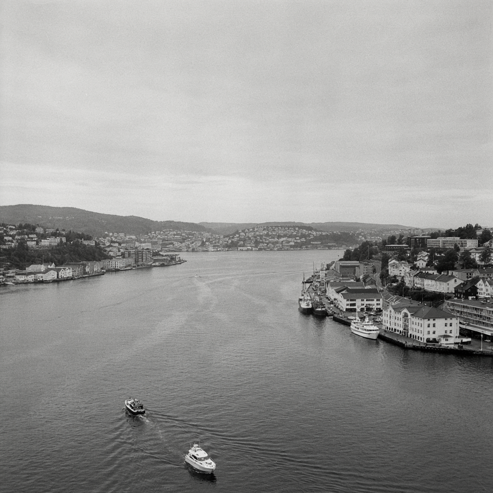 | 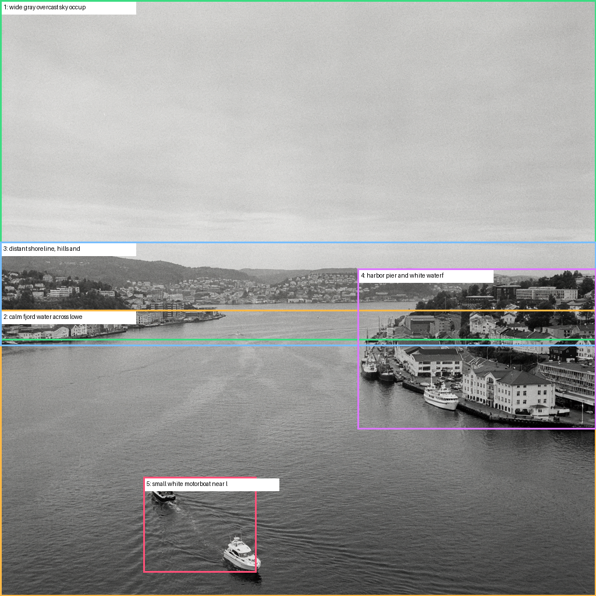 |
| Railway station | simple | 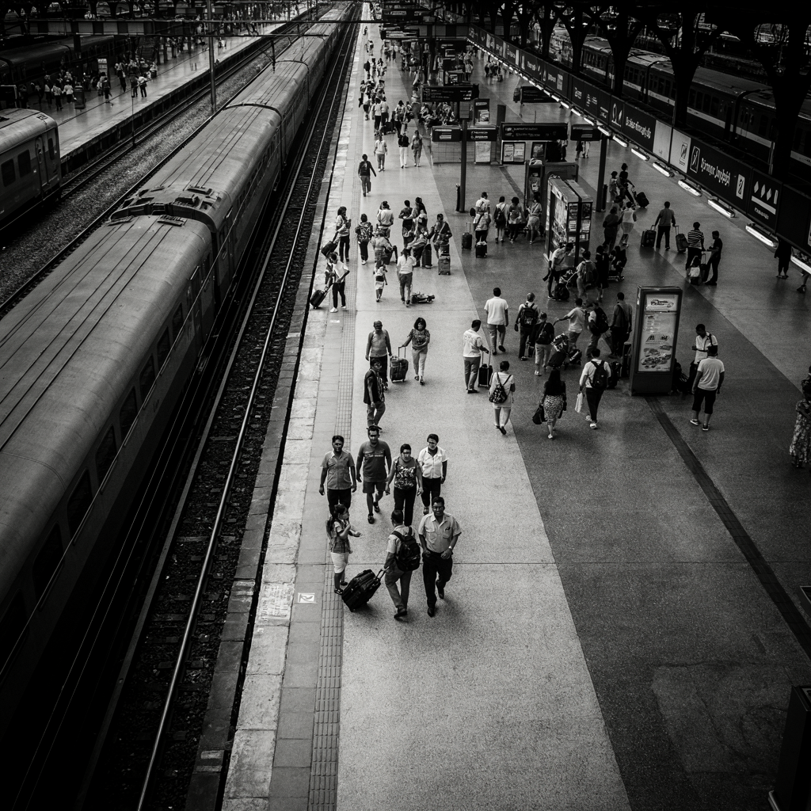 | 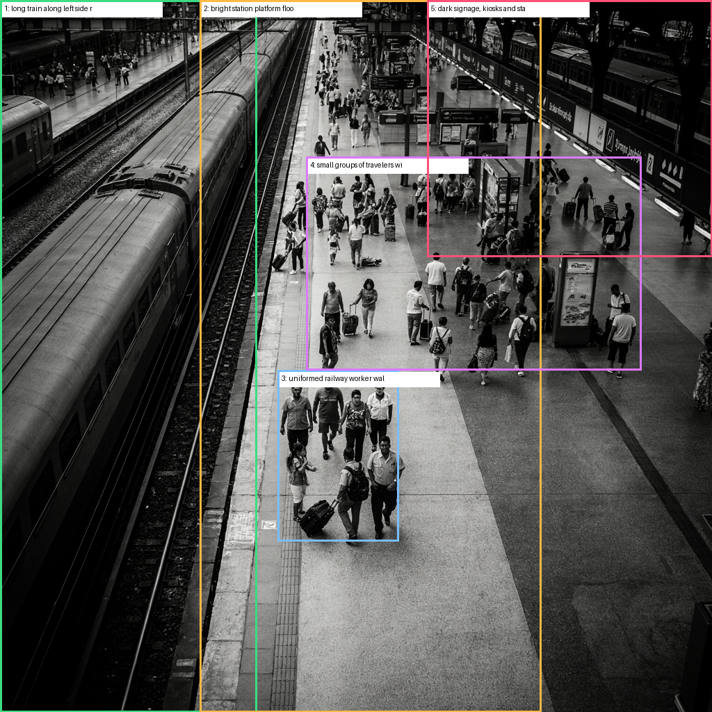 |

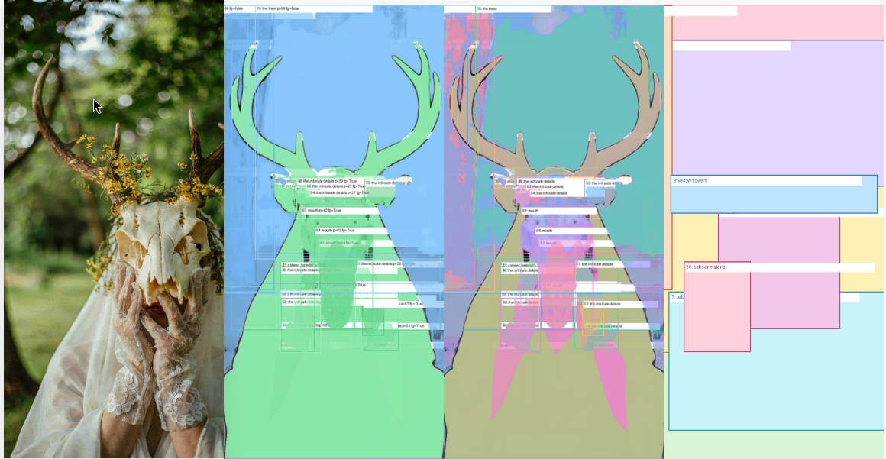

## Prerequisites 

 * models :  models/sam3/sam3.pt 
 * uv (for your virtualenvs) 
 

## Workflows

### RK Segmentation

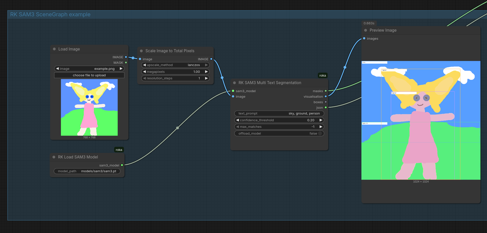

Workflow file: [`workflows/rk_sam3_scenegraph_example_workflow.json`](./workflows/rk_sam3_scenegraph_example_workflow.json)

This workflow loads an image, scales it, runs **RK SAM3 Multi Text Segmentation** with a comma-separated text prompt, and previews the resulting segmentation visualization.

### Scene Graph

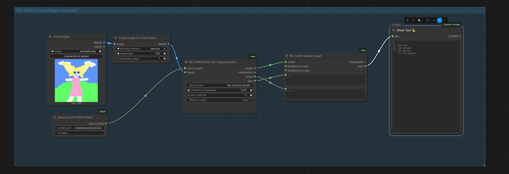

Workflow file: [`workflows/RK_SAM3_SceneGraph.json`](./workflows/RK_SAM3_SceneGraph.json)

This workflow extends SAM3 segmentation with **RK SAM3 Scene Graph** to convert detected masks and boxes into a simple object hierarchy. The ASCII output makes relationships easy to inspect or pass downstream.

```text
0
├── [0] sky
├── [1] ground
└── [2] person
    └── [3] person
```

### RK spaCy Filter

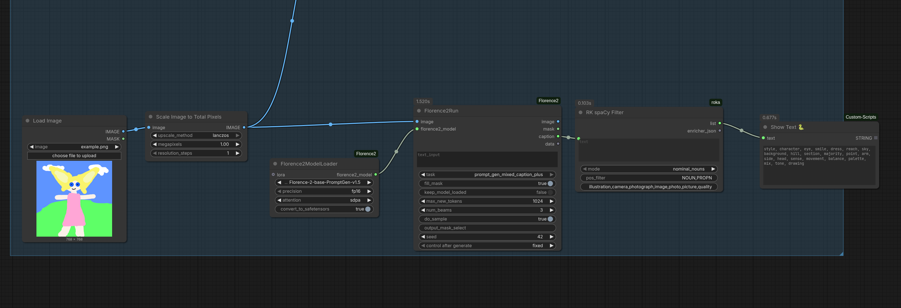

Workflow file: [`workflows/workflow_scenegraph_ascii_tree.json`](./workflows/workflow_scenegraph_ascii_tree.json)

This workflow uses a Florence2 captioning pipeline, then passes the generated caption through **RK spaCy Filter**. The node extracts and filters parts of speech, such as nominal nouns, while allowing custom stop words or excluded terms. 

> It is useful for turning verbose captions into a noun list for segmentation
